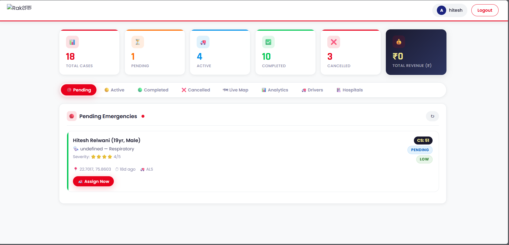
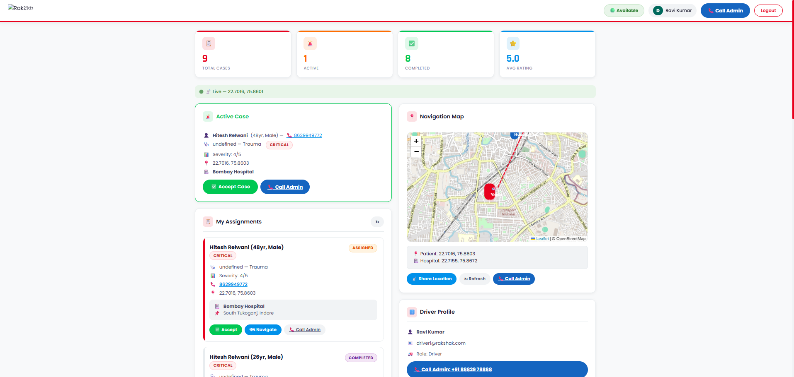
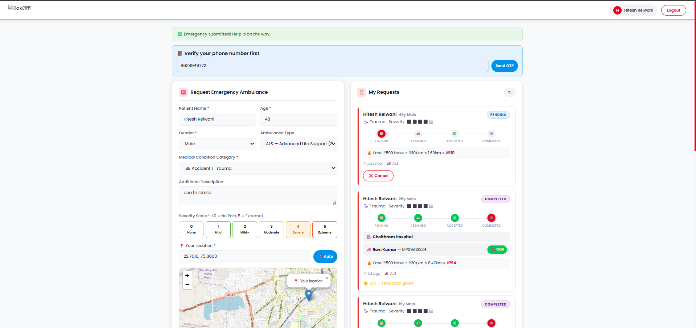

# 🚑 RAKSHAK
## AI-Powered Smart Emergency Medical Response & Ambulance Dispatch System

#### Live Demo Link :    " rakshak-backend-x6e3.onrender.com "

---

## 📁 Project Structure

```
rakshak/
├── backend/
│   ├── server.js              # Main server (Express + Socket.io)
│   ├── seeder.js              # Database seeder (sample data)
│   ├── models/
│   │   ├── User.js            # User model (patient/admin/driver)
│   │   ├── Hospital.js        # Hospital model
│   │   └── Emergency.js       # Emergency request model
│   ├── routes/
│   │   ├── authRoutes.js      # Login / Register
│   │   ├── emergencyRoutes.js # Patient emergency requests
│   │   ├── adminRoutes.js     # Admin assign + stats
│   │   ├── driverRoutes.js    # Driver accept/complete
│   │   └── hospitalRoutes.js  # Hospital CRUD
│   ├── controllers/
│   │   └── aiEngine.js        # AI scoring + Haversine + CS formula
│   └── middleware/
│       └── auth.js            # JWT authentication
├── frontend/
│   ├── index.html             # Login / Register page
│   ├── css/style.css          # Global styles
│   ├── js/utils.js            # Shared JS utilities
│   └── pages/
│       ├── patient.html       # Patient dashboard
│       ├── admin.html         # Admin dashboard
│       └── driver.html        # Driver dashboard
├── .env                       # Environment variables
└── package.json
```

---

## ⚙️ Tech Stack

| Layer      | Technology                        |
|------------|-----------------------------------|
| Frontend   | HTML5, CSS3, Vanilla JavaScript   |
| Backend    | Node.js + Express.js              |
| Database   | MongoDB + Mongoose                |
| Real-time  | Socket.io                         |
| Maps/GPS   | Leaflet.js + OpenStreetMap        |
| Auth       | JWT (JSON Web Tokens)             |
| Charts     | Chart.js                          |
| Security   | bcryptjs (password hashing)       |

---

## 🚀 Setup Instructions

### Step 1: Install Dependencies
```bash
cd rakshak
npm install
```

### Step 2: Setup MongoDB
Make sure MongoDB is running on your machine:
```bash
# Windows
net start MongoDB

# Mac/Linux
sudo systemctl start mongod
# or
brew services start mongodb-community
```

### Step 3: Configure .env
Edit `.env` file if needed:
```
PORT=5000
MONGO_URI=mongodb://localhost:27017/rakshak
JWT_SECRET=rakshak_super_secret_key_2025
JWT_EXPIRE=7d
```

### Step 4: Seed the Database
```bash
node backend/seeder.js
```
This creates sample hospitals, users (admin, drivers, patient).

### Step 5: Start the Server
```bash
npm start
# or for development (auto-reload)
npm run dev
```

### Step 6: Open in Browser
```
http://localhost:5000
```

---

## 🔑 Demo Login Credentials

| Role    | Email                    | Password   |
|---------|--------------------------|------------|
| Admin   | admin@rakshak.com        | admin123   |
| Driver  | driver1@rakshak.com      | driver123  |
| Driver  | driver2@rakshak.com      | driver123  |
| Patient | patient@rakshak.com      | patient123 |

---

## 🧠 Core Algorithm — How It Works

### 1. AI Priority Score (P)
```
Condition Text → Keyword Classifier → Score 0-100
  "accident"   → CRITICAL  → 90-100
  "heart attack"→ SEVERE   → 70-89
  "fracture"   → MODERATE → 40-69
  "fever"      → LOW      → 10-39
```

### 2. GPS Hospital Ranking (Haversine)
```
d = 2r · arcsin(√(sin²(Δlat/2) + cos(lat1)·cos(lat2)·sin²(Δlon/2)))
r = 6371 km | Threshold = 30 km
```

### 3. Composite Score (CS)
```
CS = (w1 × P) + (w2 × D) + (w3 × A)
w1=0.5  w2=0.3  w3=0.2
P = AI Priority Score (0-100)
D = 1/distance × 100
A = Availability (100 or 0)
```

### 4. Request Lifecycle
```
PENDING → ASSIGNED → ACCEPTED → COMPLETED
```

---

## 🌟 Features

- ✅ 3-Role System: Patient, Admin, Driver
- ✅ AI-based medical triage (NLP keyword engine)
- ✅ GPS location detection + Leaflet map
- ✅ Haversine formula hospital ranking
- ✅ Real-time bed availability tracking
- ✅ Composite Score dispatch engine
- ✅ Socket.io real-time notifications
- ✅ JWT Authentication
- ✅ Admin analytics with Chart.js
- ✅ Auto bed decrement on dispatch
- ✅ Auto fallback when beds = 0
- ✅ Driver location sharing
- ✅ Case lifecycle tracking

---

## 📡 API Endpoints

| Method | Endpoint                    | Role    | Description              |
|--------|-----------------------------|---------|--------------------------|
| POST   | /api/auth/register          | All     | Register user            |
| POST   | /api/auth/login             | All     | Login                    |
| GET    | /api/auth/me                | All     | Get current user         |
| POST   | /api/emergency/request      | Patient | Submit emergency         |
| GET    | /api/emergency/my           | Patient | My emergencies           |
| GET    | /api/admin/emergencies      | Admin   | All emergencies          |
| PUT    | /api/admin/assign/:id       | Admin   | Assign hospital+driver   |
| GET    | /api/admin/stats            | Admin   | Dashboard statistics     |
| GET    | /api/admin/drivers          | Admin   | Available drivers        |
| GET    | /api/driver/assignments     | Driver  | My assignments           |
| PUT    | /api/driver/accept/:id      | Driver  | Accept case              |
| PUT    | /api/driver/complete/:id    | Driver  | Complete case            |
| PUT    | /api/driver/location        | Driver  | Update GPS location      |
| GET    | /api/hospital               | All     | List hospitals           |
| POST   | /api/hospital               | Admin   | Add hospital             |

---

## 👨‍💻 Inventor
**Hitesh Relwani**
Medicaps University, Indore, Madhya Pradesh
Patent Application: RAKSHAK — FORM 2 (Patents Act, 1970)

## 📸 Project Visuals (Screenshots)

### 🏠 Home Page & User Interface
User ko welcome karne aur emergency details fill karne ke liye interface:
<p align="center">
  
  
</p>

### 👨‍✈️ Admin & Management
Admin dashboard jahan se saari requests monitor aur control hoti hain:


### 🚑 Driver & Patient Tracking
Drivers ke liye dedicated panel aur AI priority based patient details:
<p align="center">
  
  
</p>
